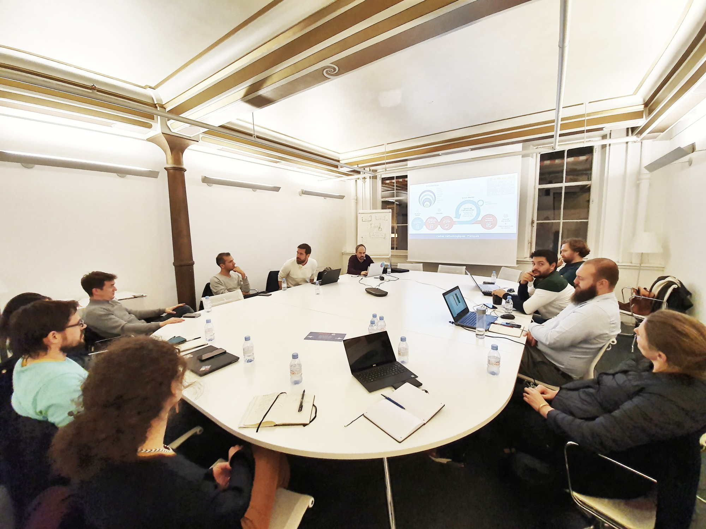
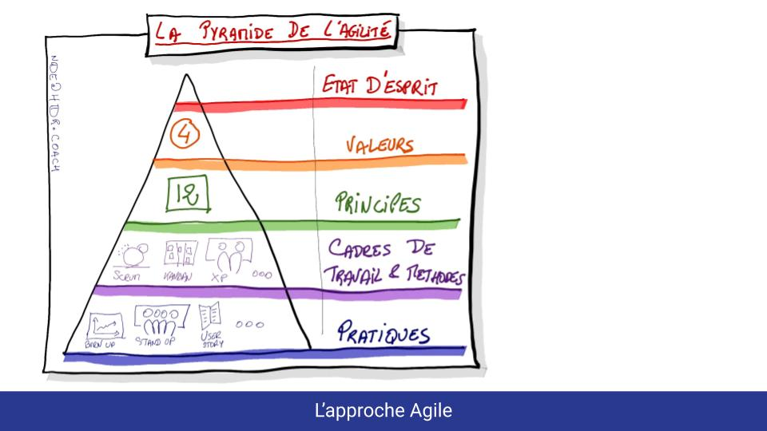
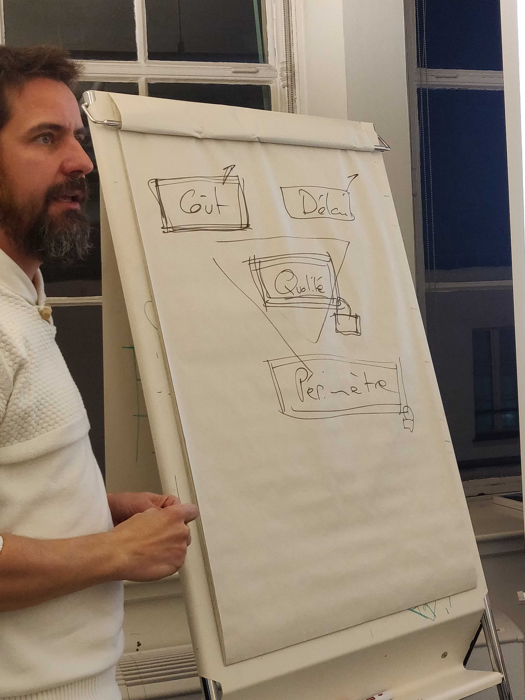
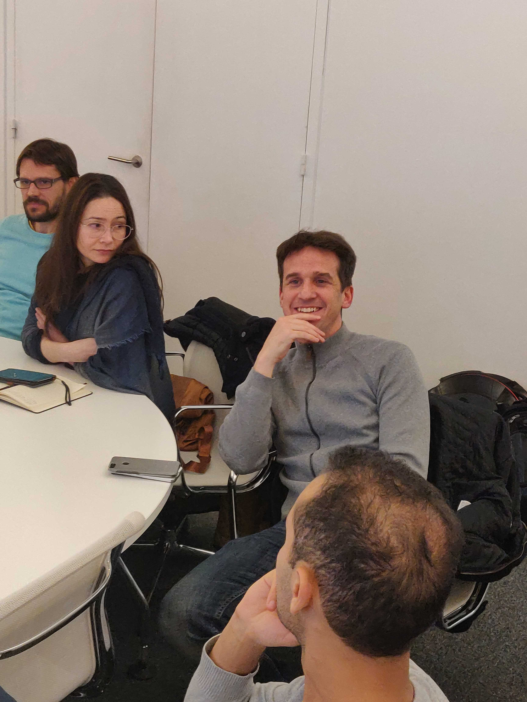
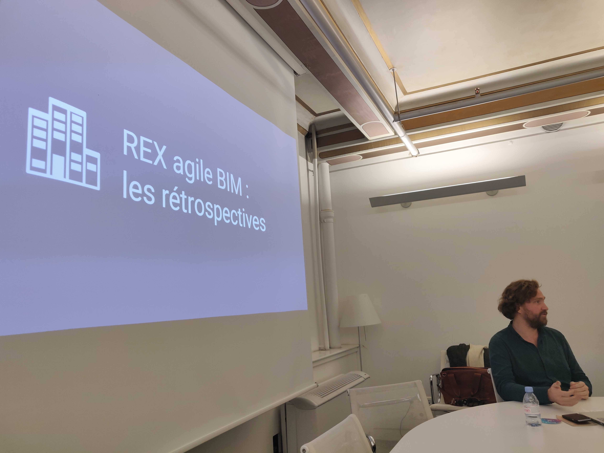
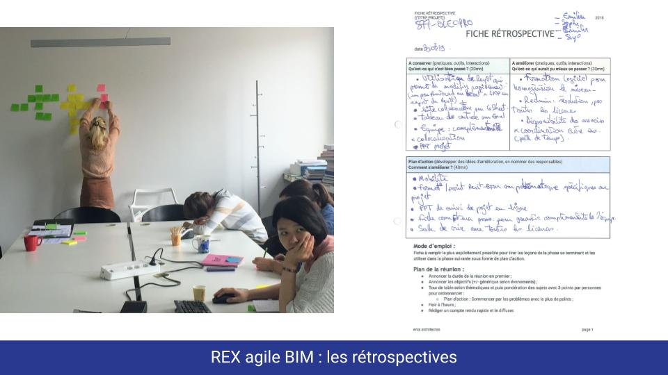

# Meetup \#4 chez Valode et Pistre

La [page du meetup](https://www.meetup.com/fr-FR/collaborative-architecture/events/266167673/)

Le meetup s'est déroulé avec 12 personnes représentant différent domaines :

* coach agile
* Architecte et BIM manager

**Merci pour l'organisation à :** 

* [Anna-Lisa de Maestri](https://www.linkedin.com/in/annalisademaestri/) \([Valode et Pistre](http://www.v-p.com/en)\)
* [Sébastien Lucas](https://www.linkedin.com/in/archiref/) \([Bricks](https://www.bricksapp.io/fr/)\)
* [François Muzard](https://www.linkedin.com/in/fran%C3%A7ois-muzard-bim/) \([Bricks](https://www.bricksapp.io/fr/)\) 
* [Laurent Coydon](https://www.linkedin.com/in/lcoydon/) / Coach Agile

Les slides du meetup : 



**Première présentation  de  François et Laurent sur les méthodes de collaboration dans la construction.**

**Puis débat animé par les Coach agile de l'assistance.**

On peut se dire Agile et ne pas l'être, et également d'être  collaboratif et agile, mais ne pas utiliser de framework. 

**Est-ce  qu'il y a une taille idéale pour une équipe agile  ?**

D'après  Scrum une petite dizaine.

**Est-ce que le client  compte  dans l'équipe ?**   
  
Il y a le PO qui  représente  le client en Scrum.

Ce qui est très important est de privilégier la relation que le contractuel. La négociation contractuelle doit  changer pour changer la relation de confiance. 

Une possibilité est de payer les intervenants en fonction de la valeur produite.

L'agile change la manière de raisonner : 

La méthode traditionnelle : Le périmètre \(le programme\) ne bouge page / Le coût, délai augmente et du coup la qualité diminue

La méthode agile : le périmètre est négociable / ce qui n'est pas négociable est la qualité.

Mais donc un gros frein est la contractualisation surtout dans le public. 

Aussi une différence est la notion de devoir terminer le bâtiment à tout prix, ce qui n'est pas toujours le cas dans un logiciel. 

Sur la phase étude, moins de différence entre l'informatique et l'architecture. 

**Quelle durée est nécessaire pour adopter les pratiques et états d'esprit agile :**   
6 mois à 2 ans 

Ne serait qu’appliquer certaines méthodes : le daily meeting par exemple peut apporter des choses.

**Comment coordonner des équipes Agile qui travaillent à distance  ?** 

Il y a des outils, mais il faut avoir de la qualité des communications et faire  attention à ne pas faire de séparation entre ceux  qui sont à distance, et ceux qui sont sur  place.

**Est-ce que le daily meeting ça marche et pourquoi ?**  

Anna Lisa de Maestri a mis  en place un daily,  mais a été  déçu par son impact. Le standup est pour l'équipe et non un rôle de reporting. 

L'équipe doit être autonome dans son  flux de valeur.

Nécessaire d'avoir un coach  extérieur  pour recadrer. 

Le daily meeting ne sert pas à communiquer, mais à prendre du recul sur ce qu'on a fait pour faire le point sur ce qui bloque sur la manière d'atteindre les objectifs. 

Comment faire pour que les gens soient à l'heure au daily.   
Leur demander comment ils veulent s'organiser  ? 

C'est un rapport coût  / bénéfice important car 15 minutes faible investissement de temps.

**Est-ce que les  tâches peuvent se superposer où est ce qu'on doit attendre qu'une tâche doit être fini ?**

Oui à chaque sprint on peut notamment réévaluer la priorité des tâches  et commencer plusieurs tâches en parallèle. Néanmoins il est important de terminer  des incréments de tâches et de les livrer. D'où l'importance de découper les tâches importantes en plus petites tâches.

**Comment on gère les tâches qui ne sont pas de la production ?** 

Ce sont des tâches. On doit devoir expliquer le besoin par rapport à la valeur produite.

**Comment on implique le client / Maître d'ouvrage.**

En BIM le client a accès à la maquette. Le client a  fait son commentaire sur la maquette. Avantage d'inclure le client dans la prise de décision, l'implique plus. Le client est toujours Ok pour  avoir des retours. Mais pour les architectes difficiles de  tout montrer.

**Retours d'expérience de François Muzard  sur sa pratique des rétrospectives à l'agence  ENIA**

 

